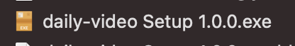
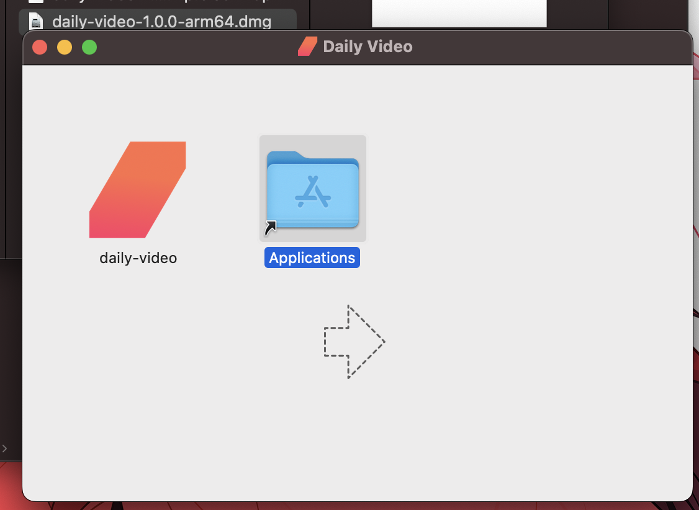

# Daily Desktop Launcher

This demo highlights [Daily Prebuilt](https://www.daily.co/products/prebuilt-video-call-app/), and how it can be used to create an Electron video call app.

Additionally, it shows how one can open the created desktop app through a browser link.

## Prerequisites

- [Sign up for a Daily account](https://dashboard.daily.co/signup).

## How the demo works

This demo embeds the Daily Prebuilt iframe into an Electron application. The application is then packaged 
into a distributable app using [Electron Builder](https://www.electron.build/).

## Running locally

### Building the desktop app

1. `cd app`
2. `npm i`
3. `npm run build`

Once the build process completes, install the app from the `out` folder. You should now be
able to run the app from your desktop.

You should run the application at least once to register the correct protocol for browser link handling.

* On Windows, run the Setup executable that gets generated and choose to run the application at the end.
  
* On Mac, run the output `.dmg` and drag the Daily Video app to your `Applications` directory, and then run the app.
  

Once the application has run once, relevant protocol handlers should be added to your registry, at which point you can 
run the app through the browser by following the steps below:

### Launching from the browser

1. Modify `launcher/index.js` with your own Daily room URL. 
2. Open the `index.html` file in your chosen browser.

The desktop application should start automatically and join your specified room.

## Contributing and feedback

Let us know how experimenting with this demo goes! Feel free to reach out to us any time at `help@daily.co`.
